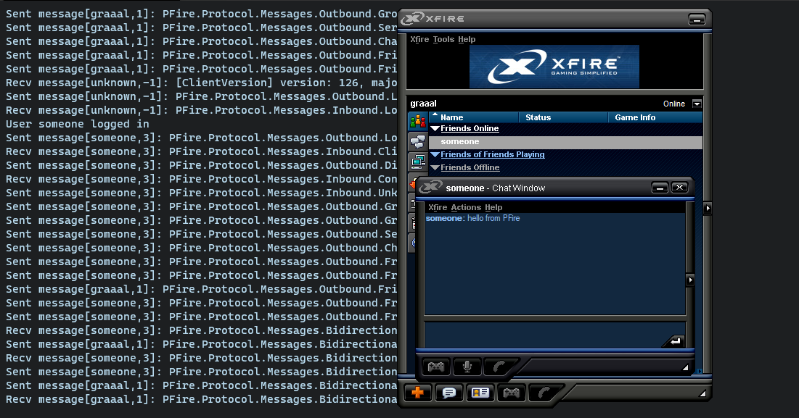

# PFire
Emulated XFire server (Client 1.127)

## Requirements
* [.Net 5 SDK](https://dotnet.microsoft.com/download)
* [XFire Client v1.127 (Dropbox)](https://www.dropbox.com/s/fjj5u0uksg6t46f/Xfire.rar?dl=0)
> _Note: If you don't trust the Dropbox link you can google for a copy of the installer._)

## Build
1. `cd src\PFire.WindowsService`
2. `dotnet build`

## Run & Connect
1. Add `cs.xfire.com` to your hosts file with your IP
   * On Windows it's located at `C:\Windows\System32\drivers\etc\hosts`
   * `127.0.0.1 cs.xfire.com`
> _Note: This is a workaround to redirect the XFire client to point to your localhost address (127.0.0.1) instead of the real server_

2. Open a command line and run the following commands from the root directory
   * `cd src\PFire.Console`
   * `dotnet run`

3. Login with the XFire client (only tested with v1.127) and an account will be created automatically if it doesn't exist

## Test
1. `cd tests\PFire.Tests`
2. `dotnet test`

# Working Features
* Friend search
* Friend requests
* Statuses
* 1 to 1 chat messaging

### Screenshots

